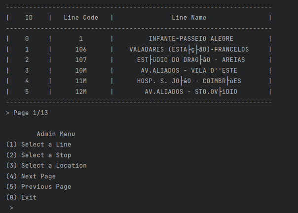
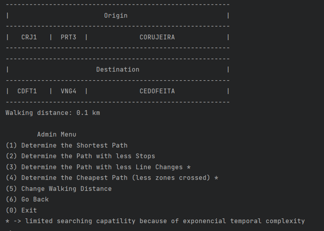
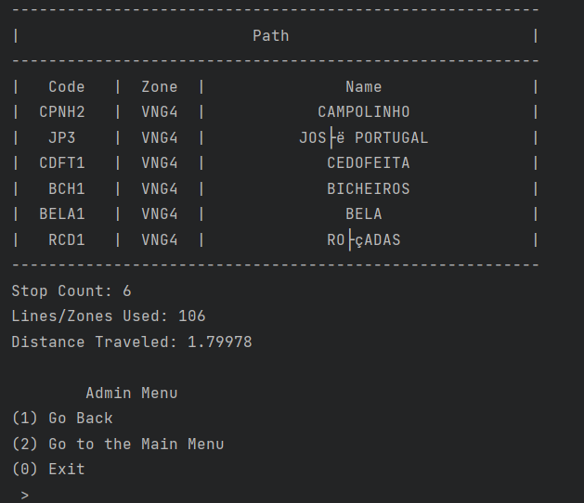

## STCP - Porto Public Transports ##

### Context

This program uses data from STCP, a company in charge of Porto's (a portuguese city) public transports.

STCP provides a dataset with information about all the stops (it's code, name and location) and lines (which stops it goes through).

I used this information, built a graph and then applied graph searches and algorithms to make the program capable of determining the shortest paths using different criteria.

Below is a simple class diagram to better visualize the structure of the project.

### Choosing the origin and destination stops ###
There are 3 possibilities while choosing each stop
- Through the menu by selecting a line and then a given stop belonging to it
- Through its unique code (e.g ARS5)
- Trough a search by latitude and longitude (returns the 5 closest stops)

### Choosing the best path ###
There are 4 different definitions of "best path" available to choose from.
- Shortest Path - uses the dijsktra algorithm with O(|E|*log|V|) complexity
- Path that crosses less stops - bfs search with O(|E|+|V|) complexity
- Path with less line changes - dfs search with O(|V|*|V|) complexity
- Path that crosses less zones - dfs search with O(|V|*|V|) complexity
|V| indicates the number of nodes or vertices
|E| indicates the number of edges in the graph (connections between nodes)
The walking distance allows the user to go to another stop without using the bus. This is usefull because there are often stops right beside each other that don't have a bus connection.

Note that the last two definitions of shortest path could be achieved with a better time complexity by using 2 ou more graphs instead of 1.

After computing the shortest path the program will show the user the stops he has to cross, the distance travelled and the lines/zones crossed in case the user used the 3rd or 4rth algorithm.

